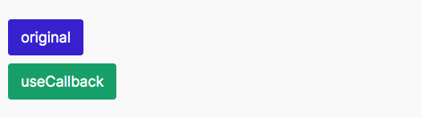

When to useMemo an useCallback

> 본 글은 원작자 [Kent C. Dodds](https://twitter.com/kentcdodds)의 허락을 맡고 진행한 번역입니다.
> 원 글은 https://kentcdodds.com/blog/usememo-and-usecallback 입니다.


Photo by Jp Valery

성능 최적화는 **항상** 그 비용이 따르고, 언제나 이점을 제공하는것은 아닙니다. useMemo와 useCallback의 비용과 이점에 대해서 이야기해봅시다.

여기 candy dispenser (사탕 자동 판매기)가 있습니다.

<iframe src="https://codesandbox.io/embed/hardcore-bash-ziqsq?autoresize=1&fontsize=14&hidenavigation=1&view=preview" title="hardcore-bash-ziqsq" allow="geolocation; microphone; camera; midi; vr; accelerometer; gyroscope; payment; ambient-light-sensor; encrypted-media" style="width:100%; height:500px; border:0; border-radius: 4px; overflow:hidden;" sandbox="allow-modals allow-forms allow-popups allow-scripts allow-same-origin"></iframe>

어떻게 그것을 구현했는지는 아래와 같습니다.

```javascript
function CandyDispenser() {
  const initialCandies = ["snickers", "skittles", "twix", "milky way"];
  const [candies, setCandies] = React.useState(initialCandies);
  const dispense = candy => {
    setCandies(allCandies => allCandies.filter(c => c !== candy));
  };
  return (
    <div>
      <h1>Candy Dispenser</h1>
      <div>
        <div>Available Candy</div>
        {candies.length === 0 ? (
          <button onClick={() => setCandies(initialCandies)}>refill</button>
        ) : (
          <ul>
            {candies.map(candy => (
              <li key={candy}>
                <button onClick={() => dispense(candy)}>grab</button> {candy}
              </li>
            ))}
          </ul>
        )}
      </div>
    </div>
  );
}
```

이제 저는 여러분에게 하나의 질문을 던지고 앞으로 여러분들이 글을 읽어나가기전에 많은 생각을 가지길 바랍니다. 저는 위에서 보여준 코드에 변화를 줄 것이고, 여러분은 저에게 어떤게 더 좋은 성능적 특성을 가질지 말해주길 원합니다.

제가 오직 바꾸려는 것은 dispense라는 함수 안에 `React.useCallback` 안에 넣는 것입니다.

```javascript
const dispense = React.useCallback(candy => {
  setCandies(allCandies => allCandies.filter(c => c !== candy));
}, []);
```

여기 원본이 있습니다:

```javascript
const dispense = candy => {
  setCandies(allCandies => allCandies.filter(c => c !== candy));
};
```

여러분에게 질문을 해보겠습니다, 이 특별한 case에서는, 이것들 중 어떤것이 성능상 더 좋을까요? 앞으로 가서 여러분의 추측을 답해보세요 (이것은 기록되지 않습니다.)


> 답안 스포일러를 방지하기위해 공간을 좀 남겨두었습니다..
> <br/> <br/> <br/> <br/> <br/> <br/> <br/> <br/> <br/> <br/>
> 계속 스크롤하세요.. 답했나요?
> <br/> <br/> <br/> <br/> <br/> <br/> <br/> <br/> <br/> <br/>
> 여러분들은 대답을 했어야만 합니다..
> <br/> <br/> <br/> <br/> <br/><br/> <br/> <br/> <br/> <br/>



정답: original

##### 왜 `usecallback`이 더 안좋은가요?

우리는 "inline 함수들은 성능에 문제를 초래할수 있다"고 많이 들었고 성능 향상을 위해 `React.useCallback`을 써야 한다고 들었습니다. 그러면 어떻게 `useCallback`을 사용하지 않는 것이 더 좋아 진 걸 까요?

한 발짝 뒤로 물러나서, React에서 이것을 고려해 봅시다: **모든 라인의 실행되는 코드들은 비용과 함께 한다.** useCallback 예제를 refactor 해 (실질적인 변화는 없고, 단지 조금 옮기는것입니다) 좀더 명확하게 설명해 봅시다.

```javascript
const dispense = candy => {
  setCandies(allCandies => allCandies.filter(c => c !== candy));
};
const dispenseCallback = React.useCallback(dispense, []);
```

그리고 여기 원본입니다:

```javascript
const dispense = candy => {
  setCandies(allCandies => allCandies.filter(c => c !== candy));
};
```

여기서 어떠한 점을 발견했나요? 달라진 부분을 확인해 봅시다:

```javascript
const dispense = candy => {
    setCandies(allCandies => allCandies.filter(c => c !== candy))
  }
+ const dispenseCallback = React.useCallback(dispense, [])//highlight-line
```

이들은 `useCallback` version이 조금 더 일을 하는것 외에는 거의 똑같습니다. 함수를 정의하는 것 뿐만아니라, 우리는 배열(\[])을 정의해야하고, 논리적인 표현들을 통해 property들을 세팅하고 실행하는`React.useCallback`을 불러야 합니다.

그래서 이 두가지 case에서 자바스크립트는 모든 render에서 함수 정의를 위해 메모리를 할당해야만하고, `useCallback`이 어떻게 구현됬는지에 따라, 여러분은 함수 정의를 위해 더 많은 메모리 할당을 하게 됩니다.(이 케이스가 확실한것은 아니지만, 요점은 적용 됩니다.) 이것은 트위터를 통해 투표를 했던 것입니다.

링크 : <https://twitter.com/kentcdodds/status/1135943012410830848>


> 허락해주신다면, 몇몇 사람들이 제가 이해하기 어렵게 말을해서, 사실은 답을 알고있음에도 불구하고 틀린답을 말했다면 사과드립니다.

저는 컴포넌트의 두번째 렌더시에는 원본 `dispense` 함수가 garbage collected 되고 (메모리 공간을 없애고) 새로운것이 생성된다고 언급합니다. 그러나 `useCallback`과 함께면 원본 `dispense` 함수는 garbage collected 되지 않고, 메모리 관점에서 더 좋지 않은 결과를 얻게 되는 것입니다.

이와 관련지어 말하면, 만약 당신이 의존성을 가지고있다면 React는 이전 function에 매달려 있습니다. 왜냐하면 memoization은 전형적으로 위의 예제와 같이 같은 의존성을 가지는 event 내에서 오래된 value들의 복사본을 가지고 있는 것을 의미하기 떄문입니다. 특별히 당신이 알아차려야 할 것은 리액트는 또한 equality check를 할때 reference에 의존한다는 것을 의미합니다. (이것은 부수적으로 클로져 덕분에 아마 발생하고,하지만 어찌되었든 언급하는것은 가치 있습니다.)

##### `useMemo`는 어떻게 다르고, 유사한가요?

`useMemo`는 `useCallback`과 어떠한 value type에 상관없이 (함수 뿐만 아니라) memoization을 적용 시킨다는 것을 제외하고는 유사합니다. 이것은 함수를 값이 변화되어야 할때만 불리는 값이 되도록 허용합니다. (전형적으로 매 시간마다 render시에 배열이 변화할때만 한번씩 동작할 것입니다.)

그래서, 만약 당신이 매 렌더마다 `initialCanies` 배열을 initialize 하기 싫으면, 이렇게 변화를 줄수 있습니다.

```javascript
- const initialCandies = ['snickers', 'skittles', 'twix', 'milky way']//highlight-line
+ const initialCandies = React.useMemo(
+  () => ['snickers', 'skittles', 'twix', 'milky way'],
+  [],
+ )
```

그리고 나는 문제를 해결했습니다, 하지만 해결한것은 매우 작고 code를 복잡하게 만들었으므로 그만큼 가치가 없게 됩니다. 사실은, 아마 `useMemo`를 사용하는 것이 좋지 않습니다. 왜냐하면 또다시 우리는 함수를 call하고, 코드는 메모리 할당을 하고 있기 때문입니다.

이 특별한 시나리오에선, 이렇게 변화시키는것이 더 좋은 case입니다:

```javascript
+ const initialCandies = ['snickers', 'skittles', 'twix', 'milky way']
  function CandyDispenser() {
-   const initialCandies = ['snickers', 'skittles', 'twix', 'milky way']//highlight-line
    const [candies, setCandies] = React.useState(initialCandies)
```

하지만 때때로 당신은 위와 같은 과도한 해결책을 가질 필요가 없습니다. 왜냐하면 거의 값은 `props`로 부터 오고, 다른 변수들은 함수안에서 initialize 되기 떄문입니다.

요점은 그렇게 중요하지 않다는 것입니다. 최적화로부터 오는 이점은 매우 작기때문에 당신의 시간은 product를 더 좋게 만드는데 투자하는게 좋을 것입니다.

##### 중요한점은 무엇인가요?

중요한점은 이와 같습니다:

**성능 최적화는 자유롭지 않습니다. 그들은 언제나 비용이들지만 항상 비용을 상쇄할만큼 이익을 가져다 주지는 않습니다**

그러므로, 최적화는 그에따른 책임감을 가져야 합니다.

##### 그러면 언제 `useMemo`와 `useCallback`을 사용해야만 하나요?

이러한 hook들이 리액트에 내장된 몇몇 이유가 있습니다:

1.  참조 동일성 (Referential equality)
2.  계산적으로 비용이 많이 드는 계산 (Computationally expensive calculations)

##### 참조 동일성 (Referential equality)

만약 당신이 javascript나 프로그래밍을 시작한지 얼마 되지 않았더라도, 이 케이스를 배우는데 큰 시간이 들지 않을 것입니다:

```javascript
true === true // true
false === false // true
1 === 1 // true
'a' === 'a' // true
{} === {} // false
[] === [] // false
() => {} === () => {} // false
const z = {}
z === z // true
// NOTE: React actually uses Object.is, but it's very similar to ===
```

저는 이것에 대해서 깊게 파고들지는 않을것입니다. 하지만 충분하게 말하면 객체는 리액트 함수형 컴포넌트 안에서 생성할때 제일 마지막에 생성된 같은 객체가 처음 정의된것과 참조적으로 동일하지 않을 것입니다. (같은 property와 같은 값을 가지고 있을때도 마찬가지 입니다.)

리액트에서 참조 동일성을 따질때가 두가지 상황이 있습니다. 한번에 모두 살펴봅시다.

#### 종속 list들 (Dependencies lists)

예제를 review 해 봅시다.

> 주의하세요, 당신은 설명을 위해 작성된 코드를 보려고 합니다. 크게 코드를 신경쓰지 마시고, 개념에 집중해 주시면 감사하겠습니다.

```javascript
function Foo({ bar, baz }) {
  const options = { bar, baz };
  React.useEffect(() => {
    buzz(options);
  }, [options]); // we want this to re-run if bar or baz change
  return <div>foobar</div>;
}
function Blub() {
  return <Foo bar="bar value" baz={3} />;
}
```

이게 문제가 되는 이유는 `useEffect`는 `options`에 대해서 referential equality 체크를 매 렌더마다 하게 되고, 자바스크립트가 작동하는 방식 때문에, `options`는 매 시간마다 매번 새롭게 만들어집니다. 그래서 리액트는 `options`가 매 렌더마다 변화 했는지 체크를 하는 테스트를 할때마다 항상 true를 반환하게 됩니다. 이것은 `useEffect` callback은 bar나 baz가 변화할때마다 불리는 것이 아니라 매 렌더마다 불리게 되는것입니다.

여기 이것을 고칠수 있는 두가지 방법이 있습니다:

```javascript
// option 1
function Foo({ bar, baz }) {
  React.useEffect(() => {
    const options = { bar, baz };
    buzz(options);
  }, [bar, baz]); // we want this to re-run if bar or baz change
  return <div>foobar</div>;
}
```

그것은 좋은 옵션이고 만약 진짜 상황에서도 사용될수 있다면 문제가 해결된 것 입니다.하지만 하나의 상황은 실용적이지 못합니다: 만약 `bar` 나 `baz` (non-primitive) 들이

객체거나/배열이거나/함수 들일 경우입니다.

```javascript
function Blub() {
  const bar = () => {};
  const baz = [1, 2, 3];
  return <Foo bar={bar} baz={baz} />;
}
```

이것은 왜 `useCallback`이나 `useMemo`가 존재하는지에 대한 정확한 이유가 됩니다. 그래서 어떻게 이것을 고쳤는지 보여드리겠습니다. (모두 지금 보여드립니다)

```javascript
function Foo({ bar, baz }) {
  React.useEffect(() => {
    const options = { bar, baz };
    buzz(options);
  }, [bar, baz]);
  return <div>foobar</div>;
}
function Blub() {
  const bar = React.useCallback(() => {}, []);
  const baz = React.useMemo(() => [1, 2, 3], []);
  return <Foo bar={bar} baz={baz} />;
}
```

> `useEffect` ,`useLayoutEffect`, `useCallback`, 그리고 `useMemo` 에 dependencies list가 전달되었을떄 같게 적용됩니다.

##### React.memo (그리고 그 친구들)

> 주의하세요, 당신은 설명을 위해 작성된 코드를 보려고 합니다. 크게 코드를 신경쓰지 마시고, 개념에 집중해 주시면 감사하겠습니다.

이것을 살펴보세요:

```javascript
function CountButton({ onClick, count }) {
  return <button onClick={onClick}>{count}</button>;
}
function DualCounter() {
  const [count1, setCount1] = React.useState(0);
  const increment1 = () => setCount1(c => c + 1);
  const [count2, setCount2] = React.useState(0);
  const increment2 = () => setCount2(c => c + 1);
  return (
    <>
      <CountButton count={count1} onClick={increment1} />
      <CountButton count={count2} onClick={increment2} />
    </>
  );
}
```

매 시간 이 버튼들을 누를때, `DualCounter`들의 상태는 변화하고 그러므로 이 컴포넌트의 re-render는 CounterButton들 모두의 re-render를 발생시킬것입니다. 그러나, 제대로 re-render가 되기 위해서는 올바르게 클릭 된 경우에만 입니다. 그래서 처음것(첫번째 CountButton 컴포넌트)을 클릭을 하면 두번째 CountButton도 아무것도 바뀌지 않았지만 re-render가 됩니다. 우리는 이런것을 "불필요한 re-render라고 합니다."

**대부분의 시간을 당신은 불필요한 re-render에 대해서 고통받지 않기위해 최적화 하는데에 써야 할것입니다.** React는 매우 빠르고 생각해야 하는 많은 것들이 있기 때문에 이러한 것들을 최적화 하는데에 시간을 쏟아야 할것입니다. 사실은, 최적화 하는 당신에게 보여줄 상황은 매우 드물고, 저는 3년동안 paypal에서 일하면서 프로덕을 리액트로 만들면서 이런 상황은 필요하지 않았습니다.

그러나, 렌더링이 실질적인 시간들의 합을 가지는 상황이 있습니다. (그래프나 차트나 애니메이션 기타등등 과 같은 것들과의 상호작용을 깊게 생각하면) 리액트의 실용주의적 성격 때문에 해결책이 있습니다:

```javascript
const CountButton = React.memo(function CountButton({ onClick, count }) {
  return <button onClick={onClick}>{count}</button>;
});
```

이제 리액트는 `CountButton`을 prop이 바뀔때만 re render 하게 됩니다! 하지만 다 끝난게 아닙니다. 참조 동일성에 대해서 모두 기억하시나요? `DualCounter` 컴포넌트에서 `DualCounter`가 리렌더 될때마다 리렌더되는 `increment1` 과 `increment2` 과 같은 함수를 정의 했습니다. 이러한 함수들은 매번 새롭게 만들어 지고 그러므로 리액트는 매번 CountButton들을 어찌되었든 re-render 할것입니다.(새로운 값이 들어왔다고 생각하므로)

그래서 `useCallback`과 `useMemo` 가 도움이 되는 아래와 같은 상황이 있습니다.

```javascript
const CountButton = React.memo(function CountButton({ onClick, count }) {
  return <button onClick={onClick}>{count}</button>;
});
function DualCounter() {
  const [count1, setCount1] = React.useState(0);
  const increment1 = React.useCallback(() => setCount1(c => c + 1), []);
  const [count2, setCount2] = React.useState(0);
  const increment2 = React.useCallback(() => setCount2(c => c + 1), []);
  return (
    <>
      <CountButton count={count1} onClick={increment1} />
      <CountButton count={count2} onClick={increment2} />
    </>
  );
}
```

이제 우리는 `CountButton`의 불필요한 re render를 막을수 있게 되었습니다.

저는 다시 반복해서 `React.memo`를 측정없이 사용하는것에 대해서 강력히 조언하고 있습니다.(PureComponent와 shouldComponentUpdate의 친구들) 왜냐하면 이러한 최적화들은 비용이 따르고 당신은 이러한 비용들이 어떻게 이점과 연관되어 있는지를 파악해야 하고 어떻게 도움이 될지(또는 어떻게 해를 끼칠지)를 결정해야 합니다, 그리고 우리가 위에서 관찰했듯이, 모든 이점을 얻을수 없기 때문에 항상 올바르게 최적화를 하는것은 까다로울수 있습니다.

##### Computationally expensive calculations

이것은 `useMemo`가 리액트의 hook에 built-in 되어 있는 또다른 이유입니다.(이것은 `useCallback`의 경우에는 적용되지 않는것을 기억하세요). `useMemo` 를 사용하는 이점은 아래와 같이 값을 가질때와 같습니다:

```javascript
const a = { b: props.b };
```

그리고 이것을 lazy하게 받아봅시다.

```javascript
const a = React.useMemo(() => ({ b: props.b }), [props.b]);
```

이것은 위와 같은 case에서는 매우 유용하지 않습니다. 하지만 동기적으로 계산을 해야하는 계산이 복잡한 function을 가지고 있다고 상상해 보세요 (저는 많은 app들이 소수를 계산할때는 [이와 같이 계산되어야 한다고 생각합니다](https://developer.mozilla.org/en-US/docs/Tools/Performance/Scenarios/Intensive_JavaScript), 이것은 예제인것을 생각해주세요)

```javascript
function RenderPrimes({ iterations, multiplier }) {
  const primes = calculatePrimes(iterations, multiplier);
  return <div>Primes! {primes}</div>;
}
```

iteration과 multiplier 가 매우 느릴수 있고, 그 특별함에 대해서 당신이 할수 있는 것이 없습니다. 당신은 자동적으로 유저들의 하드웨어를 빠르게 할수는 없습니다. 하지만 당신은 같은 값들을 두번이나 계산할 필요가 없이 useMemo가 당신을위해 이것을 하도록 만들수는 있습니다

```javascript
function RenderPrimes({ iterations, multiplier }) {
  const primes = React.useMemo(() => calculatePrimes(iterations, multiplier), [
    iterations,
    multiplier
  ]);
  return <div>Primes! {primes}</div>;
}
```

이 이유 때문에 이것은 효과를 발휘합니다. 왜냐하면 당신이 함수를 prime들을 매 렌더마다 계산하도록 정의했더라도 (매우 빠른) 리액트는 값이 필요할때만 부르게 될것입니다. 위에서 리액트는 또한 이전 value와 입력값들을 저장하고,이전과 같은 value와 입력값들을 return 하게 될것입니다. 이것이 메모이제이션이 효과를 발휘한 예제입니다.

##### 결론

저는 모든 추상화에 대해서 비용이 따른다고 말합니다. (최적화도 마찬가지로) [the AHA Programming principle](https://kentcdodds.com/blog/aha-programming) 을 적용하고 적용전, 추상화/최적화가 당신에게 비명을 지를때 까지 기다리세요. 그러면 당신은 이로부터 이익을 모두 얻지 못하고 비용이 드는 상황으로 부터 구제 될것입니다.

특별하게 `useCallback` 그리고 `useMemo`의 비용은 코드를 같이 일하는 사람에게 복잡하게 만들수 있고, 당신은 dependecies array같은데서 실수를 할수 있다는 것입니다, 그리고 당신은 잠재적으로 내재되어있는 hook들을 사용하고 dependencies 그리고 memorized 된 값들이 가비지 컬렉티드 되는것으로 부터 방지함으로써(메모리를 낭비히므로) 퍼포먼스를 안좋게 만듭니다. 이것들은 모두 성능 최적화가 필요하다면 비용이 들만 합니다. 하지만 **측정을 먼저하는것이 최우선시 되어야 합니다**

관련되서 읽으면 좋을것들:

- React FAQ: ["Are Hooks slow because of creating functions in render?"](https://reactjs.org/docs/hooks-faq.html#are-hooks-slow-because-of-creating-functions-in-render)
- [Ryan Florence](https://twitter.com/ryanflorence): [React, Inline Functions, and Performance](https://reacttraining.com/blog/react-inline-functions-and-performance)

P.S. 만약 당신이 hook으로 옮기는것을 걱정하고, 클래스 컴포넌트를 사용할때는 메소드들을 사용했지만 함수들을 우리의 함수형 컴포넌트안에 정의 하는 것을 강제 한다고 생각하는 사람들중 한명이면, 나는 당신이 우리는 (class 컴포넌트를 사용할때) 메소드들을 render 단계에서 정의하고 있었다는것을 고려하길 바랍니다. 예를 들어:

```javascript
class FavoriteNumbers extends React.Component {
  render() {
    return (
      <ul>
        {this.props.favoriteNumbers.map(number => (
          // TADA! This is a function defined in the render method!
          // Hooks did not introduce this concept.
          // We've been doing this all along.
          <li key={number}>{number}</li>
        ))}
      </ul>
    );
  }
}
```
