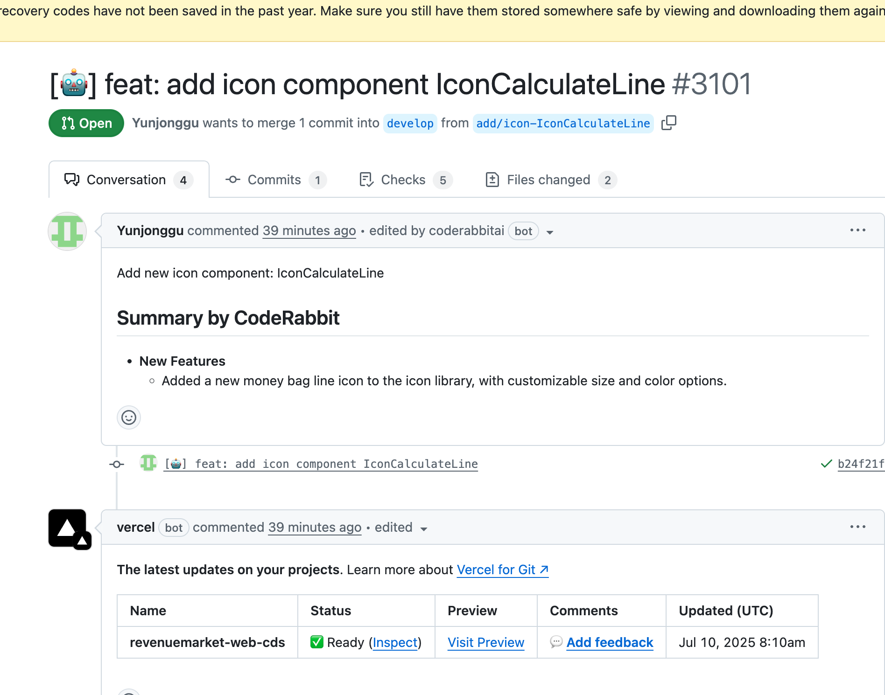
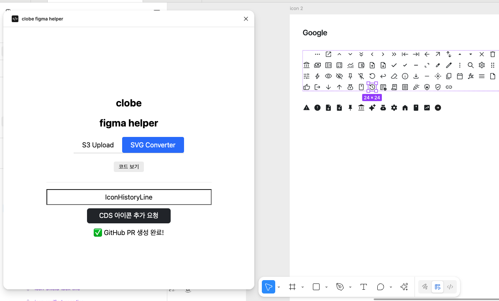
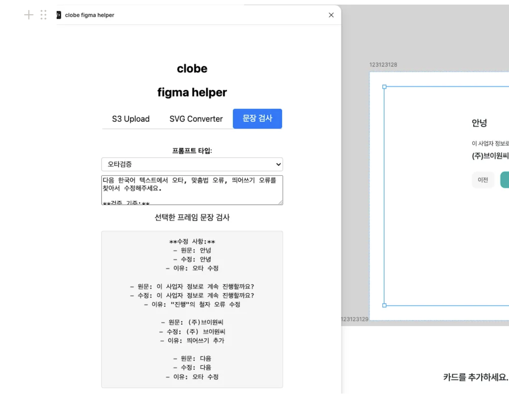

프론트엔드 개발을 하다 보면 디자이너와의 협업은 필수입니다. 하지만 이 협업 과정에서 반복적이고 비효율적인 작업들이 존재할수 있는데요.

또한 특히 스타트업처럼 리소스가 한정된 환경에서는 **"어떻게 더 잘 만들까?"** 뿐만 아니라 **"어떻게 더 잘 일할 수 있을까?"** 도 중요한 고민입니다. 그런 문제의식에서 출발해, [이 글](https://medium.com/verticah/%EC%B2%AB%EB%B2%88%EC%A7%B8-%ED%94%84%EB%A1%A0%ED%8A%B8%EC%97%94%EB%93%9C-%EC%97%94%EC%A7%80%EB%8B%88%EC%96%B4-%EB%A1%9C-%ED%95%A9%EB%A5%98%ED%95%98%EB%A9%B4-%EC%96%B4%EB%96%A4-%EC%9D%BC%EB%93%A4%EC%9D%84-%ED%95%B4%EC%95%BC%ED%95%A0%EA%B9%8C-78c7d891e3a5)에서 처럼 여러 방법들을 시도해보기도 했는데요.

이번엔 조금 더 디자이너와의 협업에 집중해서 협업과정에서의 비효율/병목을 줄이기 위한 **Figma 플러그인**을 만들었고 그 경험을 공유하면 아래와 같습니다.

## 🎯 문제 정의

### 디자이너-개발자 협업의 병목 지점

**아이콘 컴포넌트 추가 프로세스**

- 아이콘이 새로 생길 때마다 프론트엔드 개발자가 직접 디자인 시스템에 SVG 컴포넌트를 추가
- 비슷해 보이는 아이콘을 잘못 사용하여 QA 과정에서 뒤늦게 추가하고 수정하는 일이 빈번

**디자이너의 반복 작업**

- 빠듯한 일정 속에서 디자인 시안에 오타가 자주 발생
- 디자이너가 매번 ChatGPT에게 UX writing 원칙을 물어보며 수작업으로 수정
- Figma ↔ ChatGPT를 오가는 루틴이 지속적으로 반복

## 🛠️ 해결 방안

### 1. 아이콘 컴포넌트 자동 생성 플러그인

**📋 기능 개요**

> 디자이너가 Figma에서 SVG 아이콘을 선택해 GitHub에 자동으로 PR을 생성하는 플러그인

**🔄 워크플로우**

1. Figma에서 SVG 아이콘 선택
2. 내부 디자인 시스템 포맷(React SVG 컴포넌트)으로 변환
3. GitHub API를 통해 브랜치 생성, 파일 업로드, PR 생성

#### 핵심 구현 내용

**SVG to React Component 변환**

```tsx
// SVG Export 및 정리
const svgBytes = await exportNode.exportAsync({
  format: 'SVG',
  svgOutlineText: true,
  svgIdAttribute: false,
  svgSimplifyStroke: true,
});

// 불필요한 요소 제거
const cleanSvgString = svgString
  .replace(/<g[^>]*>/g, '')
  .replace(/<\/g>/g, '')
  .replace(/<defs>[\s\S]*?<\/defs>/g, '')
  .replace(/clip-path="[^"]*"/g, '');

// React 컴포넌트 템플릿 생성
const reactComponent = `
import { Colors } from '../../colors';
import { Svg } from '../../utils/IconBase';
import { IconProps } from '../../utils/icon';

const ${componentName} = ({ width = 24, height = 24, fill = Colors.gray900, ...props }: IconProps) => {
  return (
    <Svg width={width} height={height} viewBox="${viewBox}" fill="none" {...props}>
      <path d="${pathData}" fill={fill} />
    </Svg>
  );
};

export default ${componentName};
`;
```

**GitHub API를 통한 자동 PR 생성**

```tsx
// 1. 브랜치 생성
const createBranchRes = await fetch(
  `https://api.github.com/repos/${owner}/${repo}/git/refs`,
  {
    method: 'POST',
    headers: {
      Authorization: `token ${githubToken}`,
      'Content-Type': 'application/json',
    },
    body: JSON.stringify({ ref: `refs/heads/${branchName}`, sha: baseSha }),
  }
);

// 2. 파일 업로드 및 커밋
const treeRes = await fetch(
  `https://api.github.com/repos/${owner}/${repo}/git/trees`,
  {
    method: 'POST',
    body: JSON.stringify({
      base_tree: baseSha,
      tree: [
        {
          path: componentPath,
          mode: '100644',
          type: 'blob',
          sha: compBlob.sha,
        },
        { path: indexPath, mode: '100644', type: 'blob', sha: idxBlob.sha },
      ],
    }),
  }
);

// 3. PR 생성
const prRes = await fetch(
  `https://api.github.com/repos/${owner}/${repo}/pulls`,
  {
    method: 'POST',
    body: JSON.stringify({
      title: `[🤖] feat: add icon component ${pascalName}`,
      head: branchName,
      base: baseBranch,
      body: `Add new icon component: ${pascalName}`,
    }),
  }
);
```

**피그마에 진행 상태 업데이트**

```tsx
function notifyUI(msg: string) {
  figma.ui.postMessage({ type: 'github-upload-status', message: msg });
}

// 진행 단계별 상태 업데이트
const steps = [
  '브랜치 정보 조회 중...',
  '새 브랜치 생성 중...',
  'index.tsx 읽기 중...',
  'tree 생성 중...',
  '커밋 생성 중...',
  '브랜치(ref) 업데이트 중...',
];

steps.forEach((step, index) => {
  notifyUI(`${index + 1}/${steps.length}: ${step}`);
});
```

---

### 2. UX Writing/오타 검증 플러그인

**📋 기능 개요**

> 선택한 텍스트를 OpenAI API를 활용해 검토하여 UX writing 개선사항을 제안하는 플러그인

**🔄 워크플로우**

1. Figma에서 프레임 선택 → 텍스트 노드 자동 추출
2. 검사 항목(맞춤법, UX writing 등) 선택
3. 커스텀 프롬프트 설정 (선택사항)
4. OpenAI API를 통한 검토 결과 표시

#### 핵심 구현 내용

**(Figma)텍스트 노드 추출**

```tsx
function getAllTextNodes(node: SceneNode | PageNode): TextNode[] {
  let result: TextNode[] = [];

  // 숨겨진 요소 제외
  if ('visible' in node && node.visible === false) return result;

  if (node.type === 'TEXT') {
    result.push(node);
  } else if ('children' in node) {
    for (const child of node.children) {
      result = result.concat(getAllTextNodes(child));
    }
  }

  return result;
}
```

**(Figma)API에 요청**

```tsx
// UI에서 검증 요청
async function checkSpelling(text: string, promptString?: string): Promise<SpellCheckResponse> {
  return new Promise((resolve) => {
    const requestId = Math.random().toString(36).slice(2);

    function handler(event: MessageEvent) {
      const msg = event.data.pluginMessage;
      if (msg?.type === 'SPELL_CHECK_RESULT' && msg.requestId === requestId) {
        window.removeEventListener('message', handler);
        resolve(msg.result);
      }
    }

    window.addEventListener('message', handler);
    parent.postMessage({
      pluginMessage: { type: 'PROXY_SPELL_CHECK', text, requestId, promptString }
    }, '*');
  });
}
```

**(API)보안 및 접근 제어**

```tsx
// Figma 전용 접근 제한
function isFigmaRequest(req: NextApiRequest): boolean {
  const userAgent = req.headers['user-agent'] || '';
  return userAgent.includes('Figma');
}

// 토큰 기반 인증
const allowedToken = process.env.FIGMA_CORS_TOKEN;
const requestToken =
  req.headers['x-cors-token'] || req.headers['authorization'];

if (!requestToken || requestToken !== allowedToken) {
  return res.status(401).json({
    error: {
      message: 'Unauthorized. Valid token required.',
      type: 'unauthorized',
    },
  });
}
```

**(API) CORS 제어**

[참고사항]

- figma 플러그인에서 요청을 할때는 origin이 null로 와서 관련한 CORS세팅이 필수다 (figma는 iframe 기반)
- origin이 null로 오기때문에 Access-Control-Allow-Origin에 도메인 설정이 힘드므로 아래와 같이 별도 token을 통해 제어했다.

```tsx
function setCorsHeaders(req: NextApiRequest, res: NextApiResponse) {
  const requestToken =
    req.headers['x-cors-token'] || req.headers['authorization'];

  // 토큰이 일치할 때만 CORS 허용
  if (
    req.method === 'OPTIONS' ||
    (requestToken && allowedToken && requestToken === allowedToken)
  ) {
    res.setHeader('Access-Control-Allow-Origin', '*');
    res.setHeader(
      'Access-Control-Allow-Methods',
      'GET, POST, PUT, DELETE, OPTIONS'
    );
    res.setHeader(
      'Access-Control-Allow-Headers',
      'Content-Type, Authorization, x-cors-token'
    );
  }
}
```

**(API)OpenAI API 통해 검증**

```tsx
async function checkTexts(texts: string, customPrompt: string | undefined, openaiApiKey: string): Promise<string> {
  const defaultPrompt = `다음 한국어 텍스트들의 맞춤법과 문법을 검토하고 수정해주세요.`;
  const prompt = customPrompt || defaultPrompt;

  const openaiResponse = await fetch('https://api.openai.com/v1/chat/completions', {
    method: 'POST',
    headers: {
      'Content-Type': 'application/json',
      Authorization: `Bearer ${openaiApiKey}`,
    },
    body: JSON.stringify({
      model: 'gpt-3.5-turbo',
      messages: [
        { role: 'system', content: prompt },
        { role: 'user', content: `다음 문장들을 다시 작성해 주세요:\n${texts}` },
      ],
      temperature: 0.1, // 일관성을 위한 낮은 온도 설정
      max_tokens: 4096,
    }),
  });

  const openaiData = await openaiResponse.json();
  return openaiData.choices[0]?.message?.content;
}
```

## 📊 결과 및 효과

### 플러그인 사용 화면

1.아이콘 컴포넌트 PR생성




2.오타/UX writing 검증


](./figma-b.png)

### 업무 효율성 개선

#### 아이콘 컴포넌트 생성 시간 단축 ( 디자이너의 디자인시스템기여와 개발자 업무 병렬로 진행 가능)

- 기존: 디자이너 추가 요청 or 디자인 QA중 추가 필요한 아이콘 발견 → 개발자 작업 → 코드 리뷰 → 배포 -> 추가 작업
- 개선: 디자이너 직접 생성 → 자동 PR → 코드 리뷰 → 배포 -> 추후 개발자가 활용

#### 텍스트 검토 프로세스 간소화 ( 디자이너의 작업 효율성 향상)

- 기존: Figma → ChatGPT → 수동 복사 → Figma 수정 (반복)
- 개선: 기존 반복적으로 GPT<-> 피그마 서비스를 오가며 작업하는 루틴을 줄임

---
